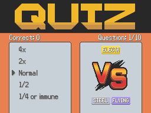
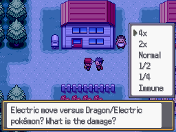

# Type Quiz
This script is for Pokémon Essentials. It's a type quiz minigame where the player must guess the multiplier of a certain type effectiveness in a certain type combination. You can use it by a normal message choice or by a scene screen.

## Screens

## Installation
Follow the [Script](/Script.rb) instructions. The sample script files are in [Files folder](/Files).